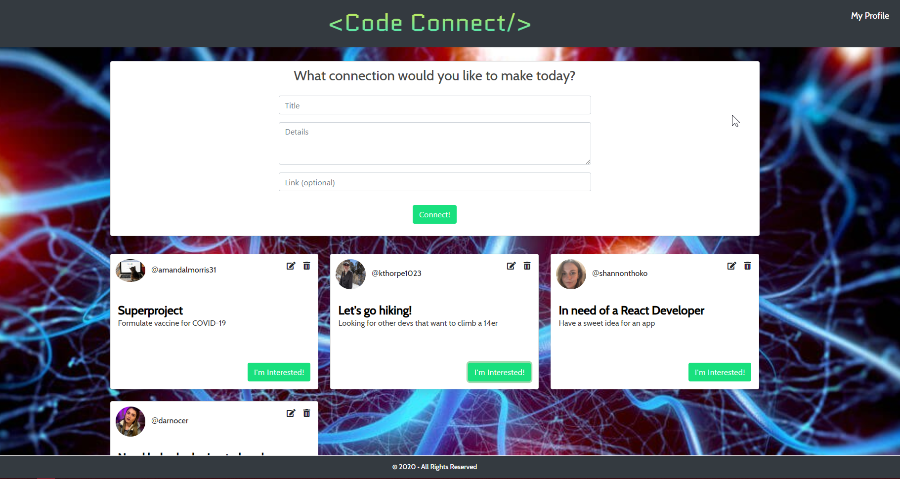
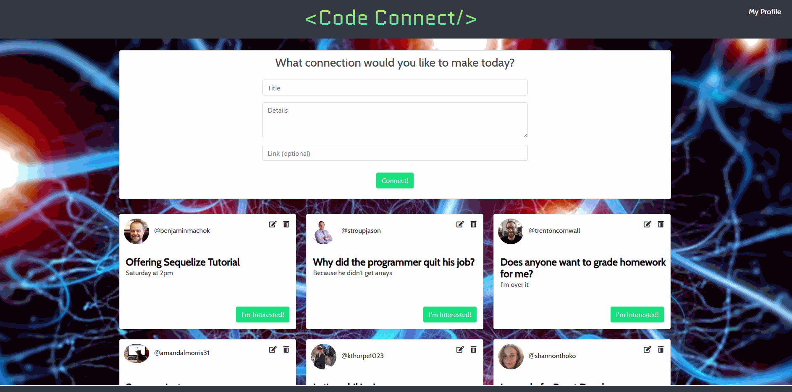

# Code Connect


### URL: http://project-02-code-connect.herokuapp.com/

## Description

A social platform for web developers to connect in order to collaborate on projects, develop new coding skills, or connect socially based on common interests.



## Table of Contents

- [Installation](#installation)
- [Usage](#usage)
- [Future Enhancements](#future-enhancements)
- [Credits](#Credits)
- [Contributors](#contributors)

## Installation

#### Cloning repo

```
fork repo
clone to local machine
```

#### Initial Setup

```
npm i to install packages
update config.json with mySQL user/password
```

#### OAuth

```
setup OAuth app on Github and connect to repo
set HomepageURL to http://localhost:3000
set Authorization callback URL to http://localhost:3000/auth/github/callback
update client id and client secret from OAuth app in server.js
```

#### Database

```
run drop/create commands from seeds.sql in mySQL workbench to create db
start server with node server.js to create tables via Sequelize
seed db starting with users table first, then projects table
```

#### Running app

```
node server.js
navigate to http://localhost:3000/auth/github
enter github credentials to be redirected to app
```

## Usage

- Authenticate through Github
- Fill out the form for click "Connect" to make a post visible by others
- Click the pencil icon to edit the details of your post
- Click the trashcan icon to delete your post
- Click "I'm Interested" to track projects you're interested in (currently only populates interested table in db for future dev)

  

## Future Enhancements

- Create a My Profile page to display your own posts, and the posts you're interested in
- Have "I'm Interested!" send an email notification to the poster
- Only edit/delete your own posts
- Display formatted timestamps for posts
- Fix link in Handlebars
- Reverse the sort order of cards
- Have input validation
- Add a searchbar
- Better mobile responsiveness

## Credits

- [Bulma](bulma.io)

- [Bootstrap](https://getbootstrap.com/)

- [jQuery](https://jquery.com/)

- [OAuth for Github](https://developer.github.com/apps/building-oauth-apps/authorizing-oauth-apps/)

- [Handlebars](https://handlebarsjs.com/)

- [Sequelize](https://sequelize.org/)
- [Express](https://www.npmjs.com/package/express)

_no learning assistants were harmed in the making of this app_

## Contributors

- Shannon Kearney [](https://github.com/shannonthoko)
- Amanda Morris [](https://github.com/amandalmorris31)
- Katie Thorpe [](https://github.com/kthorpe1023)
- Darian Nocera [](http://www.github.com/darnocer)

##### Copyright © 2020 Code Connect
